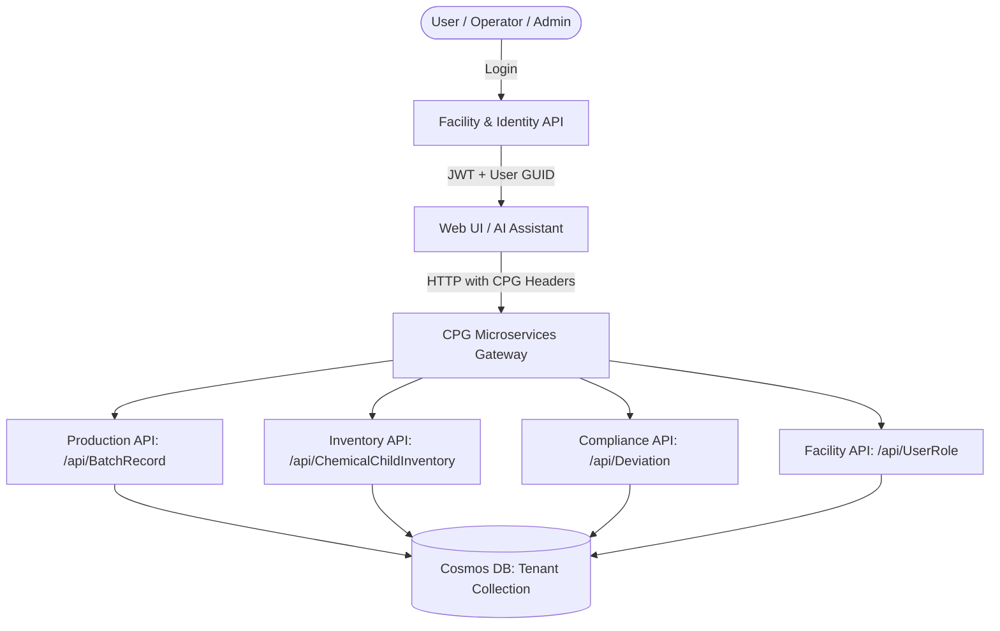
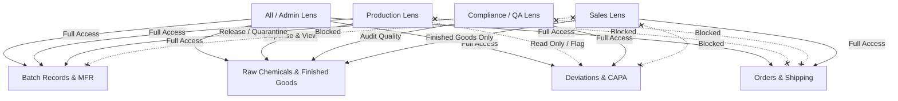
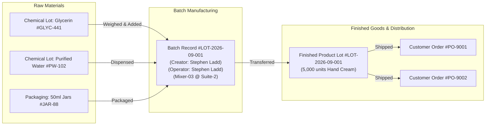
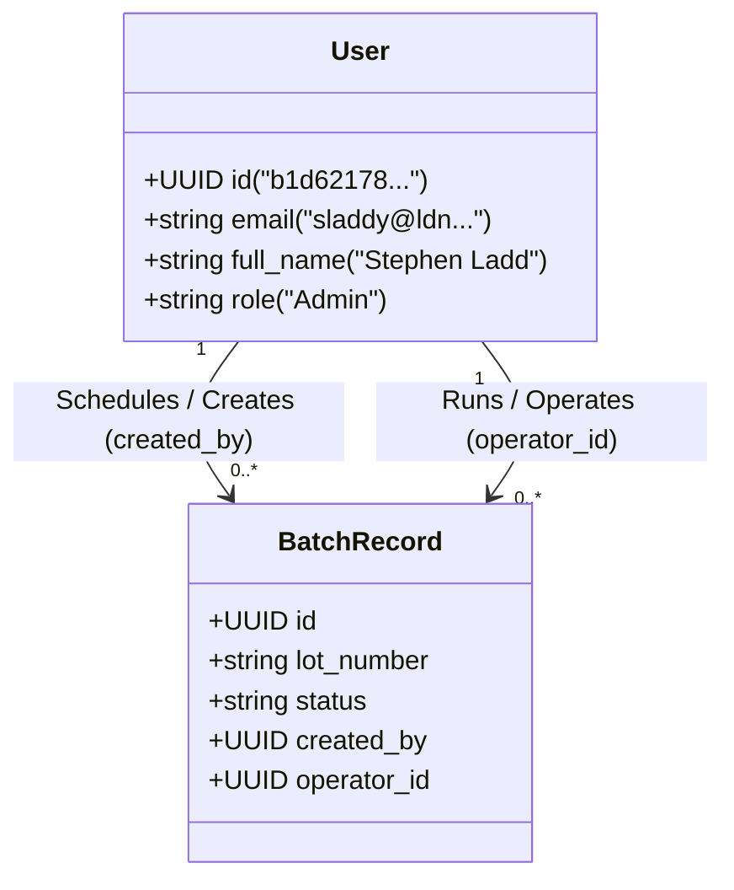
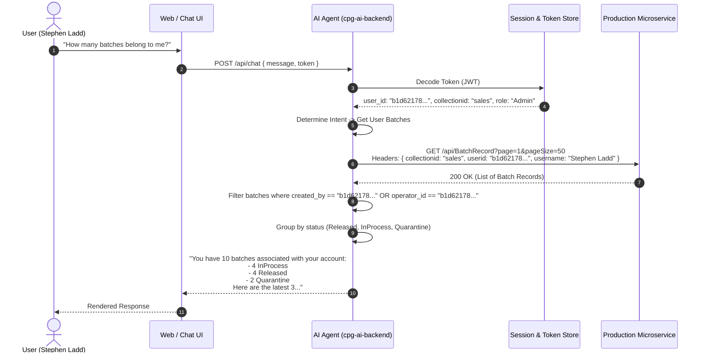

# CPG Guardian: End-to-End System Architecture, Data Flow & Ownership Model

---

## 1. Executive Summary & Core Paradigm

CPG Guardian is a multi-tenant, microservice-driven ERP/MES platform designed for regulated consumer packaged goods (cosmetics, pharmaceuticals, nutraceuticals, food & beverage) complying with **21 CFR Part 11**.

The system revolves around three core primitives:
1. **Identity & Tenant Partitioning**: Managed via Cosmos DB collection routing (`collectionid`), JWT authentication, and user GUID tracking.
2. **Master Recipes to Real-World Execution**: Master Formulation Records (MFRs) are scheduled and instantiated into executed **Batch Records**.
3. **Traceability & Attribution**: Every physical action (chemical addition, mixing, quality testing, packaging) is cryptographically or identity-linked to an operator, location, equipment, and lot number.



---

## 2. Authentication, Identity & Request Headers

### 2.1 The Two Identifiers: Email vs. GUID
In CPG Guardian:
- **`sub` (Email)**: Used in JWT authentication token for login credentials (e.g., `sladdy@ldnworldwide.com`).
- **`userid` (Database GUID)**: The unique permanent database key for the user record (e.g., `b1d62178-3d29-4b0a-9c55-706568754e66`).

> [!IMPORTANT]
> CPG microservices (**Production API**, **Inventory API**, etc.) validate access against the **GUID**, not the email. If the GUID header is missing or incorrect, queries return empty sets or unauthorized errors.

### 2.2 Mandatory Microservice Request Headers
Every downstream HTTP request from the Web Frontend or AI Backend must include:

| Header Name | Type | Example Value | Description |
| :--- | :--- | :--- | :--- |
| `authorization` | String | `Bearer eyJhbGciOi...` | Standard Bearer JWT token |
| `collectionid` | String | `sales` | Active tenant identifier (lowercased Cosmos DB container) |
| `userid` | UUID | `b1d62178-3d29-4b0a-9c55-706568754e66` | User's permanent database GUID |
| `username` | String | `Stephen Ladd` | Display name of the active user |
| `currentdate` | ISO Date | `2026-09-19T07:22:24.986Z` | Client timestamp for audit trail alignment |

---

## 3. Role-Based Access Control (RBAC) & Dashboard Lenses

Permissions are defined in the `UserRole` service (`https://facility-user-api.cpguardian.com/api/UserRole`).
Each user is assigned a primary role with a **`Dashboard_assign`** lens and module permission flags (`View`, `Add`, `Edit`, `Delete`).

### 3.1 The 4 Dashboard Lenses



### 3.2 Detailed Lens Access Matrix

| Module / Asset | All / Admin | Production Lens | Compliance / QA Lens | Sales Lens |
| :--- | :---: | :---: | :---: | :---: |
| **MFR (Master Recipes)** | Full (`CRUD`) | Full (`CRUD`) | Read / Approve (`R`) | ❌ No Access |
| **Batch Records** | Full (`CRUD`) | Full (`CRU`) | Review / Release / Hold (`RU`) | ❌ No Access |
| **Raw Chemicals** | Full (`CRUD`) | Dispense / Weigh (`RU`) | Audit / Inspect (`R`) | ❌ No Access |
| **Equipment & Rooms** | Full (`CRUD`) | Use / Log (`RU`) | Calibration / Cleanliness (`RU`) | ❌ No Access |
| **Deviations & CAPA** | Full (`CRUD`) | Create Initial Report (`C`) | Investigate / Close (`CRUD`) | ❌ No Access |
| **Finished Goods** | Full (`CRUD`) | Package / Label (`CR`) | Release / Hold (`RU`) | Read / Reserve (`RU`) |
| **Customer Orders** | Full (`CRUD`) | ❌ No Access | ❌ No Access | Full (`CRUD`) |

---

## 4. Batch Record Architecture & Lifecycle

### 4.1 What is a Batch Record?
A **Batch Record** (`/api/BatchRecord`) is the digital record of executing a Master Formulation Record (MFR) to produce a specific quantity of finished or bulk product under GMP conditions.

### 4.2 Batch Record Schema Structure
```json
{
  "id": "7fa12b84-4e91-4c12-8901-ab87321f9812",
  "batch_number": "LOT-2026-09-001",
  "mfr_id": "mfr-hand-cream-v2",
  "product_name": "Hydrating Hand Cream 50ml",
  "status": "InProcess",
  "created_info": {
    "created_by": "b1d62178-3d29-4b0a-9c55-706568754e66",
    "created_name": "Stephen Ladd",
    "created_date": "2026-09-19T06:30:00Z"
  },
  "operator_id": "b1d62178-3d29-4b0a-9c55-706568754e66",
  "operator_name": "Stephen Ladd",
  "equipment_ids": [
    "TANK-MIXER-03",
    "FILLER-LINE-B"
  ],
  "location_id": "CLEANROOM-SUITE-2",
  "scheduled_start": "2026-09-19T07:00:00Z",
  "completed_date": null,
  "chemical_components": [
    {
      "inventory_child_id": "chem-lot-glyc-9921",
      "chemical_name": "Glycerin USP",
      "lot_number": "GLYC-2026-441",
      "quantity_dispensed": 25.4,
      "unit": "kg",
      "dispensed_by": "b1d62178-3d29-4b0a-9c55-706568754e66",
      "dispensed_date": "2026-09-19T07:15:22Z"
    }
  ]
}
```

### 4.3 Lifecycle State Machine

```mermaid
stateDiagram-v2
    [*] --> Scheduled: Created from MFR by Scheduler
    Scheduled --> InProcess: Operator starts run & dispenses lots
    InProcess --> Quarantine: Run complete; samples sent to QC
    Quarantine --> Released: QA approves & digitally signs
    Quarantine --> Rejected: QA rejects; Deviation CAPA triggered
    Released --> [*]
    Rejected --> [*]
```



---

## 5. Inventory & Chemical Lineage (Traceability)

Every batch connects upstream raw materials to downstream finished goods:



### 5.1 Bi-Directional Traceability
- **Backward Geneaology (Root Cause Analysis)**:
  Given finished lot `#LOT-2026-09-001`, inspect the batch record to identify every raw chemical lot, machine used, and technician who logged in.
- **Forward Geneaology (Recall Prevention)**:
  Given contaminated raw chemical lot `#GLYC-441`, query all batch records containing that child inventory ID to locate all finished goods before shipment.

---

## 6. User Attribution: "Who Owns What?"

A critical question is: **How does the system know how many batches belong to a particular user?**

There are two primary attribution relationships:



### 6.1 Batches Created by a User
- **Field**: `created_info.created_by`
- **Definition**: The planner, manager, or lead who created or scheduled the batch record.
- **Query Filter**:
  ```python
  user_created_batches = [
      b for b in all_batches 
      if b.get("created_info", {}).get("created_by") == user_guid
  ]
  ```

### 6.2 Batches Operated by a User
- **Field**: `operator_id` or step digital signature logs
- **Definition**: The technician who performed compounding, mixing, or filling.
- **Query Endpoint**:
  ```http
  GET /v1/genealogy/operator/{user_guid}
  ```
- **Returns**: Complete historical list of all batch runs and step-level actions performed by that technician.

---

## 7. How the AI Agent Handles User Queries

When a user interacts with the AI Assistant, here is the exact sequence of how questions are processed:



---

## 8. CPG Microservice Endpoints Reference

| Service | Base URL | Relevant Endpoints | Key Functionality |
| :--- | :--- | :--- | :--- |
| **Production API** | `https://production-api.cpguardian.com/api` | `GET /BatchRecord`<br/>`GET /BatchRecord/{id}`<br/>`POST /BatchRecord`<br/>`GET /MasterFormulationRecord` | Batch scheduling, step tracking, formula execution |
| **Facility API** | `https://facility-user-api.cpguardian.com/api` | `GET /UserRole`<br/>`GET /UserRole/{id}`<br/>`GET /ManageUser`<br/>`GET /ManageUser/{id}` | Users, GUIDs, roles, dashboard lenses, permissions |
| **Inventory API** | `https://inventory-api.cpguardian.com/api` | `GET /ChemicalChildInventory`<br/>`GET /InventoryLots`<br/>`POST /Dispense` | Raw chemical lot tracking, BOM dispensing, quantities |
| **Compliance API**| `https://compliance-api.cpguardian.com/api` | `GET /Deviation`<br/>`POST /Deviation`<br/>`GET /AuditTrail` | Quality incidents, CAPAs, 21 CFR Part 11 audit records |
| **AI Backend** | `http://localhost:8000` / `/v1` | `POST /v1/chat/message`<br/>`GET /v1/genealogy/operator/{id}`<br/>`GET /v1/recommendations/batch-combo` | AI agents, lot recall, MFR combo suggestions, analytics |

---

## 9. Key Takeaways

1. **You are never blind to user identity**: Every request carries the exact tenant (`collectionid`) and user GUID (`userid`).
2. **Every batch has clear attribution**: You can always differentiate between who scheduled a batch (`created_by`) and who compounded it (`operator_id`).
3. **Traceability is end-to-end**: From incoming chemical vendor lots $\rightarrow$ batch mixing $\rightarrow$ finished good distribution.
4. **Permissions are deterministic**: Defined by `UserRole` $\rightarrow$ `Dashboard_assign` (All, Production, Compliance, Sales).

